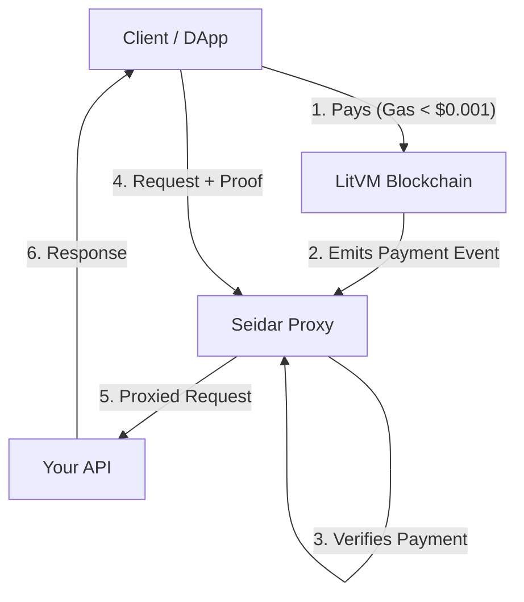

# Seidar

> [!WARNING]
> **Proof of Concept / Active Research**
> This project is currently in active development and is **not yet production-ready**.
> Features, APIs, and contracts are subject to breaking changes. Use with caution.

**Seidar** is a high-performance, blockchain-enabled reverse proxy built in Rust, designed to enable **low-friction micropayments** on the [LitVM](https://litvm.com) blockchain.

By leveraging LitVM's ultra-low gas costs, Seidar reimagines API monetization: generic "pay-per-request" models become economically viable, allowing services to charge fractions of a cent without custodial middlemen or payment channels.

## Core Mission

- **Enable True Micropayments**: Utilize LitVM's efficiency to process granular payments on-chain.
- **Trustless Access Control**: Cryptographically verify subscriptions and one-off payments.
- **High Performance**: Rust-based proxying with minimal overhead (<1ms validation).

## Features

### Core Proxy Capabilities

- **HTTP/1.1 & HTTP/2 Support** - Full protocol support via Axum and Hyper
- **WebSocket Proxying** - Transparent WebSocket connection forwarding
- **Server-Sent Events (SSE)** - Long-lived connection support with proper tracking
- **Load Balancing** - Round-robin and least-connections algorithms
- **Health Checking** - Active and passive backend health monitoring
- **Hot Reload** - Zero-downtime configuration updates

### Security & Resilience

- **Rate Limiting** - Per-IP and per-subscription rate limiting with token bucket algorithm
- **TLS Termination** - Built-in HTTPS support with rustls
- **Request Timeouts** - Configurable connect, request, and idle timeouts
- **Retry Logic** - Exponential backoff with jitter and retry budgets
- **Security Headers** - HSTS, CSP, X-Frame-Options automatically applied

### Blockchain Integration

- **Subscription Management** - On-chain subscription verification
- **Payment Processing** - Blockchain payment event monitoring
- **Quote Generation** - Cryptographically signed pricing quotes
- **Multi-tier QoS** - Tiered rate limits and connection limits per subscription level

### Observability

- **Prometheus Metrics** - Request rates, latencies, backend health
- **Structured Logging** - JSON logging with tracing integration
- **Admin Dashboard API** - Real-time status and analytics endpoints
- **Grafana Integration** - Pre-configured dashboards included

## Quick Start

### Prerequisites

- Rust 1.70+ 
- Docker & Docker Compose (for monitoring stack)

### Installation

```bash
git clone https://github.com/kings0x/Seidar.git
cd Seidar
cargo build --release
```

### Running the Proxy

1. **Start the monitoring stack:**
   ```bash
   docker-compose up -d
   ```

2. **Start a mock backend (for testing):**
   ```bash
   cargo run --example mock_backend
   ```

3. **Configure the blockchain wallet (if using blockchain features):**
   ```bash
   # Set your private key (for signing quotes)
   export PROXY_BLOCKCHAIN_PRIVATE_KEY="your-private-key-here"
   ```

4. **Start the proxy:**
   ```bash
   cargo run --release
   ```

5. **Test it:**
   ```bash
   curl http://localhost:8080/
   ```

## Configuration

Seidar uses TOML configuration. See `config.toml` for all options:

```toml
# Listener settings
[listener]
bind_address = "0.0.0.0:8080"
max_connections = 10000

# Backend definition
[[backends]]
name = "api_backend"
group = "api"
address = "127.0.0.1:3000"
max_connections = 100

# Route definition
[[routes]]
name = "api_route"
path_prefix = "/api"
backend_group = "api"

# Rate limiting
[rate_limit]
enabled = true
requests_per_second = 100
burst_size = 50

# Health checks
[health_check]
enabled = true
interval_secs = 10
path = "/health"
```

### Environment Variables

| Variable | Description |
|----------|-------------|
| `PROXY_BLOCKCHAIN_PRIVATE_KEY` | Private key for signing quotes (hex, without 0x prefix) |
| `RUST_LOG` | Log level (trace, debug, info, warn, error) |

## Architecture

Seidar sits between your clients and backend services, acting as a payment gateway and access controller.



### Why LitVM?
Traditional blockchains (Ethereum Mainnet) are too expensive for micropayments ($5+ gas to send $0.01). Seidar is optimized for **LitVM**, where gas fees are negligible, enabling a direct "Pay-for-Usage" model that doesn't require complex Layer 2 state channels.

## API Endpoints

### Proxy Endpoints

| Endpoint | Description |
|----------|-------------|
| `/*` | Proxied to configured backends |
| `/api/v1/quote` | Request a pricing quote |
| `/api/v1/quote/:id` | Retrieve a quote by ID |

### Admin Endpoints (requires authentication)

| Endpoint | Description |
|----------|-------------|
| `/admin/status` | System status and health |
| `/admin/backends` | Backend pool status |
| `/admin/analytics` | Request analytics |
| `/admin/cache` | Subscription cache status |

Admin endpoints require Bearer token authentication:
```bash
curl -H "Authorization: Bearer YOUR_API_KEY" http://localhost:3001/admin/status
```

## Monitoring

### Grafana Dashboard

Access the pre-configured Grafana dashboard at `http://localhost:3000`:

- Request rates and latencies
- Backend health status
- Rate limiting metrics
- Active connection counts

### Prometheus Metrics

Metrics are exposed at `http://localhost:9090/metrics`:

- `proxy_requests_total` - Total request count by method, status, backend
- `proxy_request_duration_seconds` - Request latency histogram
- `proxy_backend_health` - Backend health status gauge
- `proxy_rate_limited_total` - Rate limited request count
- `proxy_active_connections` - Current active connections

## Development

### Running Tests

```bash
# Unit tests
cargo test

# Load tests
cargo test --test load_test -- --nocapture
```

### Project Structure

```
src/
├── admin/          # Admin dashboard API
├── blockchain/     # Blockchain client & wallet
├── config/         # Configuration schema & loader
├── health/         # Health checking
├── http/           # HTTP server & handlers
├── lifecycle/      # Startup & shutdown
├── load_balancer/  # Load balancing algorithms
├── net/            # Network & TLS
├── observability/  # Metrics & logging
├── payments/       # Payment monitoring
├── quoting/        # Quote generation
├── resilience/     # Retries & circuit breakers
├── routing/        # Request routing
└── security/       # Rate limiting & access control
```

## License

MIT License - see [LICENSE](LICENSE) for details.

## Roadmap & Contributing

We are actively researching:
- [ ] **Dynamic Pricing**: Adjusting quote prices based on network congestion or server load.
- [ ] **One-Shot Payments**: Extending `PaymentProcessor` to support non-subscription, single-request payments.
- [ ] **Client SDKs**: Making it easy for JS/TS frontends to handle the payment flow.

Contributions are welcome! Please read our [CONTRIBUTING.md](CONTRIBUTING.md) (coming soon) or check `DEVELOPMENT_NOTES.md` for internal architecture notes.
